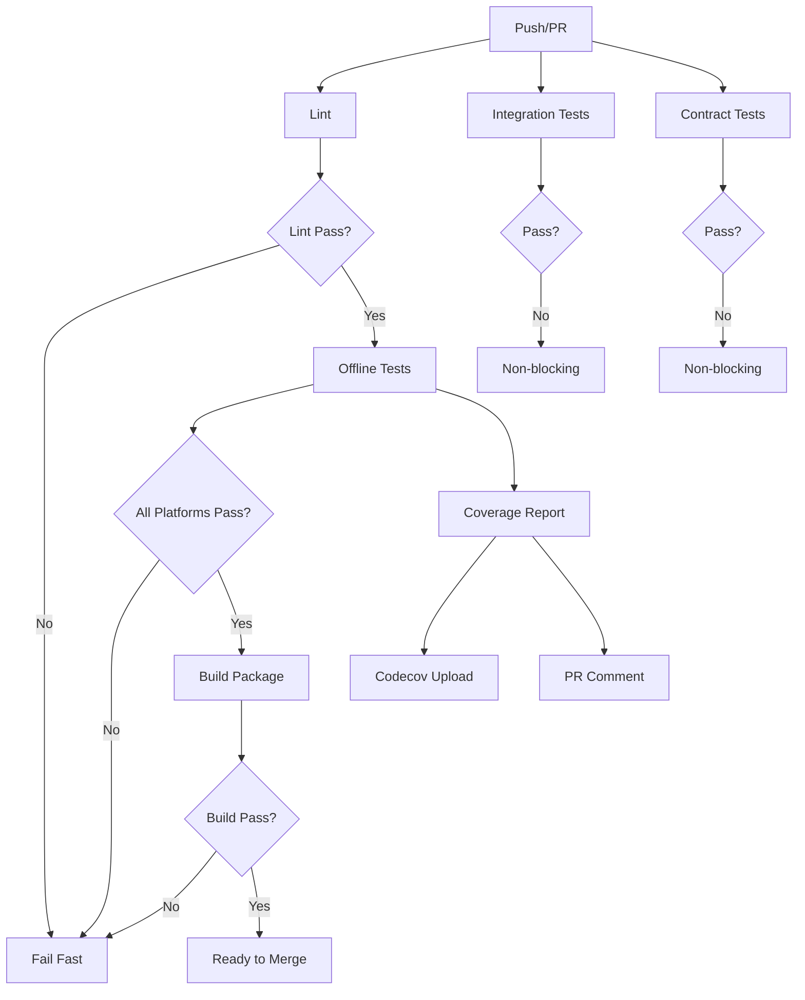

# CI/CD Guide

This document describes the continuous integration and continuous deployment (CI/CD) setup for the akshare-one project.

## Overview

The project uses GitHub Actions for automated testing and quality assurance. The CI pipeline is designed to provide fast feedback while maintaining comprehensive test coverage.

## Workflow Files

### 1. `.github/workflows/test.yml` - Multi-Platform Tests

This is the main test workflow that runs on every push and pull request.

**Triggers:**
- Push to `main`, `master`, or `develop` branches
- Pull requests to `main` or `master`
- Daily scheduled runs at 2 AM UTC (for integration tests)
- Manual workflow dispatch

**Test Jobs:**

#### Lint Job
- Runs `ruff check` for linting
- Runs `ruff format --check` for formatting
- Fast feedback on code quality
- Runs on: `ubuntu-latest`

#### Offline Tests (test-offline)
- Fast unit tests that don't require network access
- Multi-platform testing:
  - OS: `ubuntu-latest`, `macos-latest`, `windows-latest`
  - Python: `3.10`, `3.11`, `3.12`
- Excludes Windows Python 3.10 (known compatibility issues)
- Ignores integration and slow tests
- Maximum 10 failures allowed before stopping
- Required for merge

#### Integration Tests (test-integration)
- Tests that require network access
- Runs on schedule or manual dispatch
- Also runs on PRs with `run-integration` label
- Maximum 5 failures allowed
- `continue-on-error: true` - doesn't block merges

#### Contract Tests (test-contract)
- Golden sample validation
- Ensures API response schema stability
- Runs on every push and PR
- Maximum 3 failures allowed
- `continue-on-error: true` - doesn't block merges

#### Coverage Report (test-coverage)
- Generates comprehensive coverage reports
- Uploads to Codecov
- Posts coverage summary to PR
- Coverage threshold: 30% (progressive target)
- Creates HTML coverage report for download

#### Build Job
- Verifies package can be built successfully
- Uses `uv build` to create distribution
- Runs `twine check` to validate package
- Uploads dist artifacts

#### Summary Job
- Aggregates results from all test jobs
- Creates GitHub Step Summary with test results
- Fails workflow if offline tests fail

### 2. `.github/workflows/ci.yml` - Legacy CI

Original CI workflow (can be deprecated after migration).

### 3. `.github/workflows/standardization.yml` - Field Standardization

Runs field standardization checks and generates data dictionaries.

## Test Categories

### 1. Offline Tests (Default)
Fast unit tests that run without network access.

**Markers:**
```python
# No marker needed - these are default tests
# To run only offline tests:
pytest tests/ -m "not integration and not slow"
```

**Characteristics:**
- No network required
- Fast execution (< 1 minute)
- Run on every PR
- Required for merge

### 2. Integration Tests
Tests that require network access to external APIs.

**Markers:**
```python
@pytest.mark.integration
def test_external_api():
    # Test code here
    pass
```

**Running:**
```bash
# Run integration tests locally
pytest tests/ -m integration --run-integration

# Or with the conftest flag
pytest tests/ -m integration --run-integration -v
```

**Characteristics:**
- Requires network access
- Longer execution time
- Run on schedule (daily)
- Can be triggered manually
- Run on PRs with `run-integration` label

### 3. Contract Tests
Golden sample validation tests that detect upstream API changes.

**Markers:**
```python
@pytest.mark.contract
def test_api_response_schema():
    # Test code here
    pass
```

**Running:**
```bash
# Run contract tests locally
pytest tests/test_api_contract.py -m contract -v
```

**Characteristics:**
- Validates API response schemas
- Detects breaking changes early
- Runs on every push/PR
- Non-blocking (continue-on-error)

### 4. Slow Tests
Tests that take a long time to execute.

**Markers:**
```python
@pytest.mark.slow
def test_long_running_operation():
    # Test code here
    pass
```

**Running:**
```bash
# Run slow tests locally
pytest tests/ -m slow --run-slow
```

## Viewing Test Results

### 1. GitHub Actions UI
1. Go to the "Actions" tab in your GitHub repository
2. Click on the workflow run you want to view
3. Expand each job to see detailed logs
4. Check the "Summary" tab for aggregated results

### 2. Coverage Reports

#### In Pull Requests
- Coverage summary is automatically posted to PR comments
- Shows coverage percentage and changes

#### HTML Coverage Report
1. Download the `coverage-report` artifact from the workflow run
2. Extract and open `htmlcov/index.html` in your browser
3. Navigate through modules to see line-by-line coverage

#### Codecov Dashboard
- Visit the Codecov dashboard for your repository
- See coverage trends over time
- View coverage by file and directory

### 3. Test Artifacts
Each workflow run uploads test artifacts:
- `test-results-*`: Test results for each OS/Python combination
- `integration-test-results`: Integration test results
- `contract-test-results`: Contract test results
- `coverage-report`: Coverage reports
- `dist`: Built packages

Artifacts are retained for:
- Test results: 7 days
- Coverage reports: 30 days

## Debugging CI Failures

### 1. Identify the Failing Job
1. Go to the failed workflow run in Actions
2. Click on the failed job (marked with red X)
3. Expand the failing step to see error messages

### 2. Common Failure Scenarios

#### Lint Failures
```bash
# Run linting locally
uv run ruff check .
uv run ruff format --check .

# Auto-fix linting issues
uv run ruff format .
```

#### Test Failures
```bash
# Run specific test file locally
uv run pytest tests/test_stock.py -v

# Run tests with detailed output
uv run pytest tests/ -v --tb=long

# Run with print statements visible
uv run pytest tests/ -v -s

# Run specific test
uv run pytest tests/test_stock.py::test_get_stock_data -v
```

#### Coverage Failures
```bash
# Generate coverage report locally
uv run pytest tests/ --cov=akshare_one --cov-report=html

# Open coverage report
open htmlcov/index.html  # macOS
xdg-open htmlcov/index.html  # Linux
```

#### Import Errors
```bash
# Ensure dependencies are installed
uv sync --dev

# Check import
uv run python -c "from akshare_one import get_hist_data"
```

### 3. Platform-Specific Issues

If tests fail on specific platforms:

**Windows:**
- Check for path separator issues (use `pathlib.Path`)
- Check for line ending issues
- Some tests may be skipped on Windows

**macOS:**
- Usually most reliable platform
- Check for case-sensitivity issues

**Linux:**
- Default CI platform
- Most tests should pass here first

### 4. Re-running Failed Tests

1. **Re-run the entire workflow:**
   - Click "Re-run all jobs" in the Actions UI

2. **Re-run specific jobs:**
   - Click "Re-run failed jobs" in the Actions UI

3. **Debug locally:**
   ```bash
   # Pull the latest changes
   git pull

   # Create a debug environment
   uv sync --dev

   # Run the failing test
   uv run pytest tests/test_file.py::test_function -v
   ```

### 5. Viewing Test Logs

For detailed test output:
1. Click on the failing job
2. Click on the failing step
3. Scroll through the logs
4. Use browser search (Cmd/Ctrl+F) to find specific errors

### 6. Using SSH Debugging

To SSH into a GitHub Actions runner:
1. Add the following to your workflow step:
   ```yaml
   - name: Setup tmate session
     uses: mxschmitt/action-tmate@v3
   ```
2. The workflow will pause and print SSH connection details
3. Connect via SSH to debug interactively
4. Remember to remove this before merging!

## Manual Workflow Triggers

### Running Integration Tests Manually

1. Go to Actions tab
2. Select "Multi-Platform Tests" workflow
3. Click "Run workflow"
4. Check "Run integration tests"
5. Click "Run workflow" button

### Running Contract Tests Manually

Same as above, but check "Run contract tests".

## Best Practices

### 1. Writing CI-Friendly Tests

```python
# Good: Fast, isolated, no network
def test_data_processing():
    """Test data processing with mock data."""
    from akshare_one import process_data

    # Use fixtures or mock data
    mock_data = pd.DataFrame({"close": [1, 2, 3]})

    result = process_data(mock_data)
    assert not result.empty

# Avoid: Slow, network-dependent
@pytest.mark.integration
def test_real_api():
    """Test with real API - mark as integration."""
    from akshare_one import get_real_data

    data = get_real_data()  # Will fail offline
    assert not data.empty
```

### 2. Using Test Markers

```python
import pytest

# Integration test (requires network)
@pytest.mark.integration
def test_api_call():
    pass

# Slow test
@pytest.mark.slow
def test_large_dataset():
    pass

# Contract test
@pytest.mark.contract
def test_api_schema():
    pass

# Skip on specific platforms
@pytest.mark.skipif(platform.system() == "Windows", reason="Not supported on Windows")
def test_unix_only():
    pass
```

### 3. Handling Test Data

```python
# Use fixtures for test data
@pytest.fixture
def sample_data():
    return pd.DataFrame({
        "timestamp": pd.date_range("2024-01-01", periods=10),
        "close": [100 + i for i in range(10)]
    })

def test_with_fixture(sample_data):
    assert len(sample_data) == 10
```

### 4. Platform-Specific Tests

```python
import platform

import pytest

@pytest.mark.skipif(platform.system() == "Windows", reason="Unix-specific test")
def test_unix_feature():
    # Test that only works on Unix/Linux/macOS
    pass

@pytest.mark.skipif(platform.system() != "Windows", reason="Windows-specific test")
def test_windows_feature():
    # Test that only works on Windows
    pass
```

## Coverage Goals

Current coverage threshold: **30%**

The project uses a progressive coverage strategy:

### Tiered Coverage Targets

1. **Core modules** (`client.py`, `modules/base.py`, `modules/factory_base.py`): 75%
2. **Important modules** (etf, bond, futures, index, financial, historical, realtime): 60%
3. **Extension modules** (all others): 50%

### Improving Coverage

1. Run coverage report locally:
   ```bash
   uv run pytest tests/ --cov=akshare_one --cov-report=html
   ```

2. Open `htmlcov/index.html` to see uncovered lines

3. Write tests for uncovered code paths

4. Focus on critical business logic first

## Troubleshooting

### Issue: Tests pass locally but fail in CI

**Causes:**
- Different Python version
- Different OS
- Missing dependencies
- Environment variables
- Network issues

**Solutions:**
1. Match CI Python version locally
2. Check OS-specific code paths
3. Ensure all dependencies are in `pyproject.toml`
4. Use environment variables or secrets in CI
5. Mock network calls or use integration test markers

### Issue: Coverage decreased

**Causes:**
- New code without tests
- Removed tests
- Changed code paths

**Solutions:**
1. Write tests for new code
2. Update tests for changed code
3. Check coverage report for uncovered lines

### Issue: Integration tests always fail

**Causes:**
- Network issues
- API rate limits
- API changes

**Solutions:**
1. Use `continue-on-error: true` for integration tests
2. Add retry logic
3. Mock external APIs when possible
4. Update golden samples if API changed

### Issue: Windows tests failing

**Causes:**
- Path separator issues
- Line ending issues
- Platform-specific code

**Solutions:**
1. Use `pathlib.Path` instead of string paths
2. Configure git for cross-platform line endings
3. Add platform-specific skip markers
4. Fix platform-specific bugs

## CI/CD Pipeline Flow



## Workflow Configuration

### Adding New Python Version

1. Update `pyproject.toml`:
   ```toml
   requires-python = ">=3.10"
   ```

2. Update workflow matrix:
   ```yaml
   strategy:
     matrix:
       python-version: ['3.10', '3.11', '3.12', '3.13']
   ```

3. Test locally with new version

### Adding New Platform

1. Update workflow matrix:
   ```yaml
   strategy:
     matrix:
       os: [ubuntu-latest, macos-latest, windows-latest]
   ```

2. Handle platform-specific issues
3. Add platform-specific skip markers if needed

### Adjusting Coverage Threshold

1. Update `pyproject.toml`:
   ```toml
   [tool.coverage.report]
   fail_under = 40  # Increase threshold
   ```

2. Update workflow:
   ```yaml
   --cov-fail-under=40
   ```

3. Ensure coverage meets new threshold

## Resources

- [GitHub Actions Documentation](https://docs.github.com/en/actions)
- [pytest Documentation](https://docs.pytest.org/)
- [coverage.py Documentation](https://coverage.readthedocs.io/)
- [Codecov Documentation](https://docs.codecov.com/)
- [Ruff Documentation](https://docs.astral.sh/ruff/)

## Getting Help

1. Check this guide first
2. Search existing GitHub Issues
3. Create a new issue with:
   - Link to failing workflow
   - Error messages
   - Steps to reproduce locally
   - Expected vs actual behavior